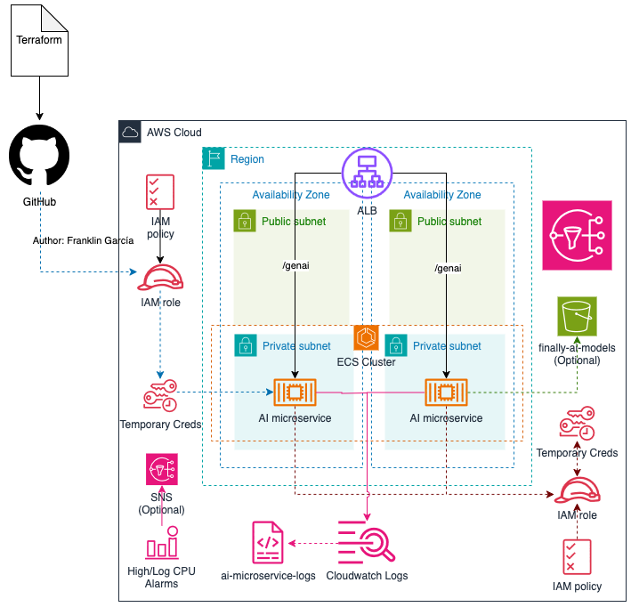

# AWS ECS Microservice Terraform Module

This Terraform module creates and manages an Amazon ECS service with associated resources including task definitions, security groups, load balancer target groups, and auto-scaling configurations. It is designed for Platform Engineering and DevOps teams to enable secure, consistent, and fast service deployments by product engineering teams.

## Overall Platform Architecture

This module is designed to fit into a larger ecosystem that typically includes:

- VPC: Network isolation and security boundaries
- Database: RDS instances or other data storage solutions  
- Load Balancing: Application Load Balancer for traffic distribution
- Monitoring: CloudWatch for logging and metrics
- Security: IAM roles, security groups, and KMS encryption
- Service Discovery: AWS Cloud Map for service-to-service communication

The module enables developers to deploy containerized applications that can scale automatically based on CPU utilization and integrate seamlessly with existing AWS infrastructure.

### Architecture Diagram Components



- Amazon ECS (Fargate): Serverless container orchestration
- CloudWatch Logs: Centralized and secure logging
- Application Load Balancer (ALB): Handles routing and health checks
- IAM Roles: Fine-grained least-privilege access for execution and task roles
- Auto Scaling: Dynamic scaling based on CPU thresholds
- S3 Access: Optional access to defined buckets (e.g., finally-ai-models)
- SNS Notifications: Optional alarm notification integration

## Module Design & Usage

### Inputs

This reusable module accepts the following key inputs:

- Project Configuration: Project name, environment, AWS region
- Container Configuration: Image, CPU, memory, port mappings, environment variables
- ECS Configuration: Cluster ID, task family, desired count, launch type
- Network Configuration: VPC, subnets, security groups, load balancer settings
- Auto-scaling Configuration: Min/max capacity, CPU thresholds
- Logging Configuration: CloudWatch log groups, retention, KMS encryption

### Self-Service Capabilities

This module enables development teams to:

- Deploy containerized applications without deep AWS knowledge
- Configure auto-scaling based on application needs
- Set up monitoring and logging automatically
- Integrate with existing load balancers and networking

## CI/CD Pipeline

### Application Deployment Pipeline

For product teams deploying applications:

1. Build Stage: Container image build and push to ECR
2. Test Stage: Automated testing of the application
3. Deploy Stage: Terraform apply with updated image tags
4. Validation Stage: Health checks and smoke tests

### Infrastructure Module Pipeline

For platform teams managing the module:

1. Validation: Terraform validate and plan
2. Security Scanning: Checkov, tfsec for security compliance
3. Release: Semantic versioning and module registry publication

Key Tools: GitHub Actions, Terraform Cloud, Sonarqube, Cloudwatch for monitoring

## Security & Compliance

### Security Best Practices

This module enforces security best practices including:

- Least Privilege: IAM roles with minimal required permissions
- Secure by Default:
  - Encryption at rest using KMS
  - Flexibility to use encryption in transit for all communications
  - Private subnets for container workloads
  - Security groups with restrictive rules

### SOC 2 Compliance

The module supports SOC 2 compliance through:

- Logging: Comprehensive CloudWatch logging with encryption
- Monitoring: CloudWatch metrics and alarms for security events
- Access Control: IAM-based access control with audit trails
- Data Protection: KMS encryption for sensitive data
- Network Security: VPC isolation and security group controls
- Immutable logs
- Tracing for IaC changes
- Defined access boundaries

## Assumptions & Trade-offs

### Key Assumptions

1. Single Container per Service: The module is designed for single-container services
2. Fargate Focus: Optimized for AWS Fargate launch type
3. ALB Integration: Assumes Application Load Balancer for traffic routing
4. CloudWatch Logging: Uses CloudWatch Logs as the primary logging solution
5. ALB is created externally (not part of this module)
6. Responsibility for VPC/Subnets lies outside this module

### Design Trade-offs

1. Simplicity vs. Flexibility:
   - Choice: Simplified interface with sensible defaults
   - Trade-off: Less flexibility for complex multi-container scenarios

2. Opinionated Defaults vs. Customization:
   - Choice: Opinionated defaults for security and compliance
   - Trade-off: May require customization for specific use cases

3. Auto-scaling Approach:
   - Choice: CPU-based auto-scaling as default
   - Trade-off: May not be optimal for all application types

## Prerequisites

Before using this module, ensure the following AWS resources exist in your environment:

### Required Infrastructure

1. ECS Cluster
   - An existing Amazon ECS cluster (can be EC2-based or Fargate)
   - Container Insights enabled
   - The cluster must be in the same region where you plan to deploy the service

2. Application Load Balancer (ALB)
   - A configured Application Load Balancer
   - ALB listener with at least one HTTPS listener
   - The ALB must be in the same VPC as your ECS cluster

3. KMS Key for Logging
   - A KMS key with appropriate policies for CloudWatch Logs encryption
   - The key policy must allow the ECS service to encrypt/decrypt log data
   - Required permissions: kms:Encrypt, kms:Decrypt, kms:ReEncrypt*, kms:GenerateDataKey*, kms:DescribeKey

4. Network Infrastructure
   - VPC with appropriate subnets (public/private based on your architecture)
   - Internet Gateway (for public subnets) or NAT Gateway (for private subnets)

5. IAM Roles and Policies
   - ECS Task Execution Role with necessary permissions
   - ECS Task Role (if your containers need AWS API access)
   - Appropriate policies attached to these roles

## Quick Start

### Basic Usage Example

module "ecs_service" {
  source = "git::https://github.com/your-org/terraform-aws-ecs-service.git?ref=v1.0.0"

  # Project Configuration

  project_name = "my-app"
  environment  = "production"
  aws_region   = "us-east-1"

  # ECS Configuration

  cluster_id    = "arn:aws:ecs:us-east-1:123456789012:cluster/my-cluster"
  task_family   = "my-app-production"
  task_cpu      = 512
  task_memory   = 1024
  desired_count = 2

  # Container Configuration

  container_name     = "my-app"
  container_image    = "123456789012.dkr.ecr.us-east-1.amazonaws.com/my-app:latest"
  container_cpu      = 256
  container_memory   = 512
  container_port     = 8080
  container_environment_variables = {
    "NODE_ENV" = "production"
    "PORT"     = "8080"
  }

  # Network Configuration

  vpc_id           = "vpc-12345678"
  subnets          = ["subnet-12345678", "subnet-87654321"]
  alb_listener_arn = "arn:aws:elasticloadbalancing:us-east-1:123456789012:listener/app/my-alb/1234567890123456/1234567890123456"

  # Auto Scaling

  scale_target_min_capacity = 1
  scale_target_max_capacity = 10
  max_cpu_threshold         = 70
  min_cpu_threshold         = 30

  # Logging

  log_retention_days = 30
  kms_key_id        = "arn:aws:kms:us-east-1:123456789012:key/12345678-1234-1234-1234-123456789012"

  tags = {
    Environment = "production"
    Team        = "platform"
  }
}

## Module Structure

.
├── main.tf
├── variables.tf
├── outputs.tf
├── README.md
└── examples/
      ├── ai-service-staging/
      └── ai-service-production/

- main.tf: Core module logic and AWS resources
- variables.tf: All input variables with validations and defaults
- outputs.tf: Key output values for referencing module results
- examples/: End-to-end working configurations for staging and production workloads

## Key Features

- Provision ECS Service, Task Definitions, and CloudWatch Log Groups
- IAM Roles with managed and inline policy attachments
- Load Balancer listener rules and health checks
- Auto Scaling policy configuration
- Tagging support for cost tracking and compliance
- TLS-optional logging encryption with KMS
- Support for service discovery (namespace) with optional DNS setup
- Seamless integration into DevOps pipelines (CI/CD) and GitOps models

## DevOps & CI/CD Pipeline Integration

### For DevOps Engineers

The module is designed to be easily integrated into CI/CD pipelines to support GitOps or automated deployment workflows:

1. Ephemeral Environment Provisioning:
   - DevOps teams can instantiate preview environments (e.g., for feature branches)
   - Destroy after use with terraform destroy

2. Multi-Stage Promotion Pipelines:
   - Use workspaces or backend configuration for dev/staging/prod promotion
   - Parameterize environment-specific variables using separate .tfvars files

3. Pipeline Example (GitHub Actions):

```yaml
name: ECS Service Deployment

on:
  push:
    branches: [main]
  pull_request:
    branches: [main]

env:
  AWS_REGION: us-east-1
  TERRAFORM_VERSION: 1.5.7

jobs:
  deploy:
    runs-on: ubuntu-latest
    steps:
      - uses: actions/checkout@v3
      
      - name: Set up Python virtual environment
        run: |
          python3 -m venv venv
          source venv/bin/activate
          pip install --upgrade pip
          pip install -q checkov
      
      - name: Run Checkov Security Scan
        run: |
          source venv/bin/activate
          checkov -f *.tf --quiet
      
      - name: Terraform Format Check
        run: terraform fmt -check
      
      - name: Configure AWS Credentials
        uses: aws-actions/configure-aws-credentials@v2
        with:
          role-to-assume: ${{ secrets.ROLE_GITHUB }}
          aws-region: ${{ env.AWS_REGION }}
      
      - name: Setup Terraform
        uses: hashicorp/setup-terraform@v2
        with:
          terraform_version: ${{ env.TERRAFORM_VERSION }}
      
      - name: Create tfvars from secrets
        run: |
          echo '${{ secrets.MYAPP_TFVAR }}' > terraform.tfvars
      
      - name: Terraform Init
        run: terraform init
      
      - name: Terraform Plan
        run: terraform plan
      
      - name: Terraform Apply
        if: github.ref == 'refs/heads/main'
        run: terraform apply -auto-approve
```

### Platform Module Release Pipeline

For changes to the module itself:

- Validate formatting with terraform fmt
- Validate inputs with terraform validate
- Run linting with tflint and security checks with checkov
- Optionally publish tagged releases to a private module registry or GitHub release

## Requirements

- Terraform >= 1.5.0
- AWS CLI configured
- Docker installed (for image builds)
- Backend state (e.g., S3 + DynamoDB) configured outside

## Providers

| Name | Version |
|------|----------|
| aws | 5.100.0 |


## Resources

| Name | Type |
|------|------|
| aws_appautoscaling_policy.scale_down_policy | resource |
| aws_appautoscaling_policy.scale_up_policy | resource |
| aws_appautoscaling_target.scale_target | resource |
| aws_cloudwatch_log_group.ecs_log_group | resource |
| aws_cloudwatch_metric_alarm.cpu_high | resource |
| aws_cloudwatch_metric_alarm.cpu_low | resource |
| aws_ecs_service.ecs_service | resource |
| aws_ecs_task_definition.ecs_task | resource |
| aws_iam_policy.task_role_policy | resource |
| aws_iam_role.task_role | resource |
| aws_iam_role_policy_attachment.managed_policy_attachment | resource |
| aws_iam_role_policy_attachment.task_role_attachment | resource |
| aws_lb_listener_rule.main_alb | resource |
| aws_lb_target_group.alb | resource |
| aws_security_group.main | resource |
| aws_service_discovery_private_dns_namespace.namespace | resource |
| aws_region.current | data source |
| aws_service_discovery_dns_namespace.existing | data source |

## Inputs

| Name | Description | Type | Default | Required |
|------|-------------|------|---------|:--------:|
| alb_listener_arn | ARN ALB Listener. | string | "arn:aws:elasticloadbalancing:us-east-1:841162703316:loadbalancer/net/myprojectmy-workload-dev/18a9a0132121ceeb" | no |
| alb_listener_rules | ALB listener rules configuration. IMPORTANT: The service names (keys) in this map must match the container names defined in the container_name variable, as they are used for target group mapping. | map(map(object)) | n/a | yes |
| assign_public_ip | Assign a public IP address to the ECS service. | bool | false | no |
| aws_region | The AWS region to deploy the resources. | string | "us-east-1" | no |
| compatibilities | The launch types the task definition is compatible with. | list(string) | ["FARGATE"] | no |
| container_cpu | CPU units for the container | number | 256 | no |
| container_environment_variables | Map of environment variables for the container | map(string) | {} | no |
| container_essential | Whether the container is essential | bool | true | no |
| container_image | Docker image for the container | string | "public.ecr.aws/nginx/nginx:latest" | no |
| container_memory | Memory (in MiB) for the container | number | 512 | no |
| container_name | Name of the container | string | "nginx-svc" | no |
| container_port | Port that the container exposes | number | 80 | no |
| cooldown | Cooldown period for scaling actions | number | 60 | no |
| desired_count | The number of tasks to run. | number | 1 | no |
| ecs_cluster_id | ECS cluster ID. | string | "arn:aws:ecs:us-east-1:841162703316:cluster/myprojectmy-workload-dev-ecs-cluster" | no |
| environment | Deployment Environment | string | "development" | no |
| exec_role_arn | Execution role ARN. | string | "arn:aws:iam::841162703316:role/ecs-myprojectmy-workload-dev-task-exec-iam-role" | no |
| force_new_deployment | This can be used to update tasks to use a newer Docker image with same image/tag combination | bool | true | no |
| health_check_path | Path health_check ALB | string | "/health" | no |
| host_port | Host port to map to container port | number | 80 | no |
| kms_key_id | The ARN of the KMS Key to use when encrypting log data. If not provided, logs will not be encrypted. | string | null | no |
| launch_type | The launch type on which to run your ECS service. | string | "FARGATE" | no |
| log_retention_days | Number of days to retain CloudWatch logs | number | 7 | no |
| managed_policies | List of managed policy ARNs to attach to the ECS task role. | list(string) | ["arn:aws:iam::aws:policy/AmazonEC2ContainerRegistryPullOnly"] | no |
| max_cpu_evaluation_period | The number of periods over which data is compared to the specified threshold for max cpu metric alarm | string | "3" | no |
| max_cpu_period | The period in seconds over which the specified statistic is applied for max cpu metric alarm | string | "60" | no |
| max_cpu_threshold | Threshold for max CPU usage | string | "85" | no |
| min_cpu_evaluation_period | The number of periods over which data is compared to the specified threshold for min cpu metric alarm | string | "3" | no |
| min_cpu_period | The period in seconds over which the specified statistic is applied for min cpu metric alarm | string | "60" | no |
| min_cpu_threshold | Threshold for min CPU usage | string | "10" | no |
| namespace | The app namespace to deploy the resources and local DNS. | string | "my-workload" | no |
| network_mode | The Docker networking mode to use for the containers in the task. | string | "awsvpc" | no |
| project_name | Name of the project | string | "my-workload" | no |
| scale_target_max_capacity | The max capacity of the scalable target | number | 5 | no |
| scale_target_min_capacity | The min capacity of the scalable target | number | 1 | no |
| security_group_rules_cidrs | Map of security group rules with CIDR block, port, and description | map(object) | See variables.tf | no |
| security_group_rules_prefix_list_id | Map of security group rules with Prefix List, port, and description | map(object) | See variables.tf | no |
| security_group_rules_security_group_id | Map of security group rules with Security Group Id, port, and description | map(object) | See variables.tf | no |
| sns_topic_arn | The ARN of an SNS topic to send notifications on alarm actions. | string | "" | no |
| subnets | List of subnet IDs for the service. | list(string) | ["subnet-0521aa00427d156e0", "subnet-0854fca60e5b9ef64"] | no |
| tags | A map of tags to assign to resources. | map(string) | {} | no |
| target_group_protocol | Protocol for the Target Group: HTTP or HTTPS | string | "HTTP" | no |
| target_type | Target type: instance, ip, lambda or alb. | string | "ip" | no |
| task_cpu | The number of CPU units for the task. | string | "512" | no |
| task_family | Family of the ECS task definition. | string | "my-workload-nginx" | no |
| task_memory | The amount of memory (in MiB) to allocate for the task. | string | "1024" | no |
| task_role_policy | IAM Policy document for the ECS task role in JSON format. | string | See variables.tf | no |
| use_existing_namespace | Indicates whether to use an existing Service Discovery namespace or create a new one | bool | false | no |
| vpc_id | VPC ID | string | "vpc-0db92d66d4dd147da" | no |

## Outputs

| Name | Description |
|------|-------------|
| ecs_service_names | Names of the ECS Services created |
| ecs_task_definition_arn | ARN of the ECS Task Definition |
| sec_group_id | ID of the Security Group |
| circuit_breaker_alarm_arns | ARNs of the Circuit Breaker CloudWatch Alarms |

## License

MIT License

## Support

For questions or issues, please:

1. Check the `examples/` directory for common use cases
2. Review the variables.tf file for all available options
3. Open an issue in the repository
4. Contact the Platform Engineering team
